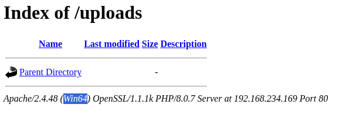

# 8.Craft
## Reconnaissance
### All port scanning
#### TCP
* `nmap -p- -Pn -T4 -sS --min-rate 1000 -oN Results_tcp.txt 192.168.234.169`
```sh
Starting Nmap 7.99 ( https://nmap.org ) at 2026-09-11 10:15 +0530
Nmap scan report for 192.168.234.169
Host is up (0.100s latency).
Not shown: 65534 filtered tcp ports (no-response)
PORT   STATE SERVICE
80/tcp open  http

Nmap done: 1 IP address (1 host up) scanned in 93.71 seconds
```
With this we can conclude that there is only 1 port open which is showing us a web page.
* `nmap -A -p- -Pn 192.168.234.169`
```sh
nmap -A -p- -Pn 192.168.234.169
Starting Nmap 7.99 ( https://nmap.org ) at 2026-09-11 10:52 +0530
Nmap scan report for 192.168.234.169
Host is up (0.14s latency).
Not shown: 65534 filtered tcp ports (no-response)
PORT   STATE SERVICE VERSION
80/tcp open  http    Apache httpd 2.4.48 ((Win64) OpenSSL/1.1.1k PHP/8.0.7)
|_http-title: Craft
|_http-server-header: Apache/2.4.48 (Win64) OpenSSL/1.1.1k PHP/8.0.7
Warning: OSScan results may be unreliable because we could not find at least 1 open and 1 closed port
Device type: general purpose
Running (JUST GUESSING): Microsoft Windows 2019|10 (92%)
OS CPE: cpe:/o:microsoft:windows_server_2019 cpe:/o:microsoft:windows_10
Aggressive OS guesses: Microsoft Windows Server 2019 (92%), Microsoft Windows 10 1903 - 22H2 (85%), Microsoft Windows 10 1607 (85%)
No exact OS matches for host (test conditions non-ideal).
Network Distance: 4 hops

TRACEROUTE (using port 80/tcp)
HOP RTT       ADDRESS
1   184.71 ms 192.168.45.1
2   184.61 ms 192.168.45.254
3   184.81 ms 192.168.251.1
4   184.82 ms 192.168.234.169

OS and Service detection performed. Please report any incorrect results at https://nmap.org/submit/ .
Nmap done: 1 IP address (1 host up) scanned in 132.52 seconds
```
#### UDP
* `nmap -sU -A --top-ports 20 -oN Results_udp.txt 192.168.234.169`
```sh
Starting Nmap 7.99 ( https://nmap.org ) at 2026-09-11 10:20 +0530
Note: Host seems down. If it is really up, but blocking our ping probes, try -Pn
Nmap done: 1 IP address (0 hosts up) scanned in 3.58 seconds
```
### Web
We found the web page <br>
<br>
#### Sub-Directory Enumeration
`gobuster dir -u http://192.168.234.169/ -w /usr/share/wordlists/dirb/common.txt`
```sh
===============================================================
Gobuster v3.8.2
by OJ Reeves (@TheColonial) & Christian Mehlmauer (@firefart)
===============================================================
[+] Url:                     http://192.168.234.169/
[+] Method:                  GET
[+] Threads:                 10
[+] Wordlist:                /usr/share/wordlists/dirb/common.txt
[+] Negative Status codes:   404
[+] User Agent:              gobuster/3.8.2
[+] Timeout:                 10s
===============================================================
Starting gobuster in directory enumeration mode
===============================================================
.htaccess            (Status: 403) [Size: 304]
.hta                 (Status: 403) [Size: 304]
.htpasswd            (Status: 403) [Size: 304]
assets               (Status: 301) [Size: 343] [--> http://192.168.234.169/assets/]
aux                  (Status: 403) [Size: 304]
cgi-bin/             (Status: 403) [Size: 304]
com2                 (Status: 403) [Size: 304]
com1                 (Status: 403) [Size: 304]
com3                 (Status: 403) [Size: 304]
con                  (Status: 403) [Size: 304]
css                  (Status: 301) [Size: 340] [--> http://192.168.234.169/css/]
examples             (Status: 503) [Size: 404]
index.php            (Status: 200) [Size: 9635]
js                   (Status: 301) [Size: 339] [--> http://192.168.234.169/js/]
licenses             (Status: 403) [Size: 423]
lpt2                 (Status: 403) [Size: 304]
lpt1                 (Status: 403) [Size: 304]
nul                  (Status: 403) [Size: 304]
phpmyadmin           (Status: 403) [Size: 423]
prn                  (Status: 403) [Size: 304]
server-status        (Status: 403) [Size: 423]
server-info          (Status: 403) [Size: 423]
uploads              (Status: 301) [Size: 344] [--> http://192.168.234.169/uploads/]
webalizer            (Status: 403) [Size: 423]
Progress: 4613 / 4613 (100.00%)
===============================================================
Finished
===============================================================
```

* With this we found out that the webpage is made on php and there seems to be admin page as well but for the time being it seem inaccessable.
* We also have uploads folder and have access to it's web interface. As noticed earlier of the upload functionality.<br>
<br>
<br>
* This tells us we can only upload ODT file format.

## Exploitation
### Privilege Escalation
# SOVLED!
